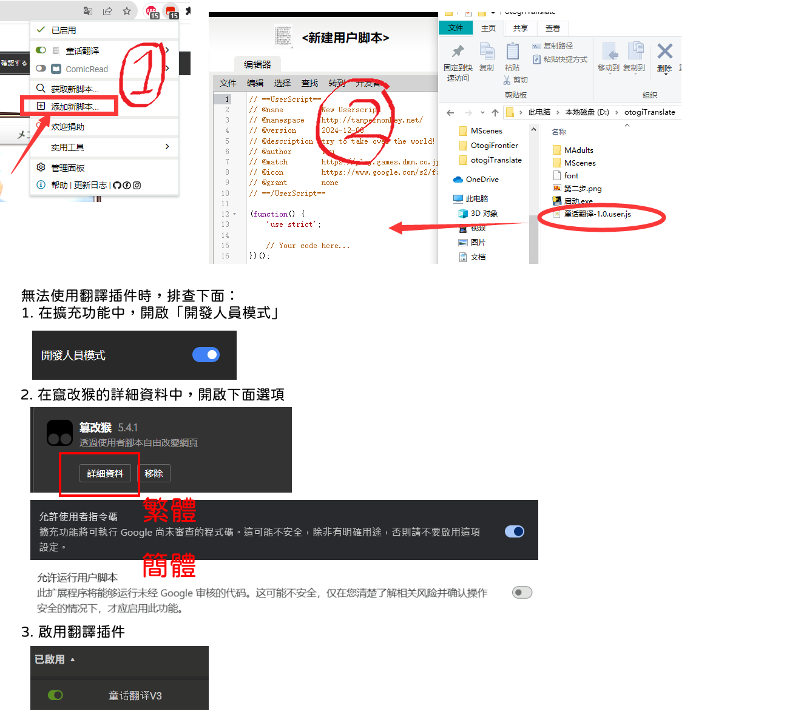
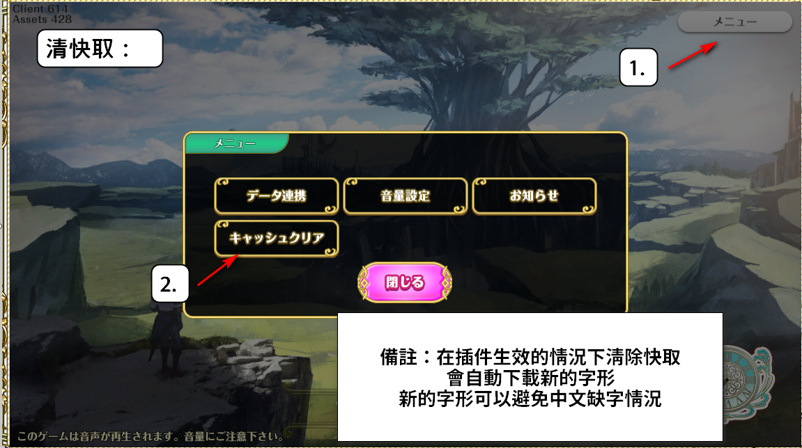

# otogitranslate｜童話前線中文翻譯

《童話前線》（オトギフロンティア / Otogi Frontier）的中文翻譯資料與瀏覽器使用者腳本。腳本在遊戲載入資料時，以本專案的 JSON 字典替換日文文字，並將字型請求導向支援中文字的字型資源。

目前提供繁體、簡體劇情翻譯，以及可選的角色／精靈名稱翻譯。實際翻譯範圍取決於對應的資料檔案與原文是否能匹配。

## 功能

- 替換 `MAdults`、`MScenes`、`MStory` 與 `EventVoice` 相關 API 回傳的文字。
- 透過設定選擇繁體或簡體劇情翻譯。
- 可選擇使用 `trans_dict.json` 翻譯角色與精靈名稱。
- 在部分劇情列表中，確認有對應翻譯檔案後加上 `[翻譯]` 標記。
- 將 `Assets/font` 請求重新導向中文字型資源，減少中文缺字情況。

## 安裝與使用

一般使用只需安裝使用者腳本，不需要 Python，也不需要在本機啟動伺服器。翻譯資料由腳本從 GitHub 讀取。

1. 在瀏覽器安裝並啟用 Tampermonkey 使用者腳本擴充功能。
2. 開啟 Tampermonkey，選擇「新增腳本」。
3. 開啟本專案的 [童前翻譯插件.js](./童前翻譯插件.js)，複製完整內容，覆蓋編輯器的預設內容後儲存。
4. 確認腳本已啟用，重新載入遊戲。
5. 若字型仍使用舊快取，在遊戲標題畫面選擇「メニュー」→「キャッシュクリア」，再重新載入。

腳本目前的匹配網址為：

```text
https://otogi-rest.otogi-frontier.com/*
```

若遊戲嵌入其他網站，請確認擴充功能允許腳本在上述遊戲框架中執行。

### 安裝圖示

以下為既有操作圖示；圖中的舊腳本名稱請以目前的 `童前翻譯插件.js` 為準。





## 語言與名稱設定

在 Tampermonkey 編輯器中修改腳本開頭的兩個設定，儲存後重新載入遊戲：

```javascript
// 0 = 繁體，1 = 簡體
const SimplifiedChinese = 0

// 0 = 關閉角色名稱翻譯，1 = 開啟
const CharChinese = 0
```

| 設定 | 值 | 行為 |
| --- | --- | --- |
| `SimplifiedChinese` | `0`（預設） | 載入 `<ID>.json` |
| `SimplifiedChinese` | `1` | 載入 `<ID>_gb.json` |
| `CharChinese` | `0`（預設） | 不替換角色／精靈主資料的名稱 |
| `CharChinese` | `1` | 使用 `trans_dict.json` 替換 `MMonsters.gz`、`MSpirits.gz` 的名稱 |

角色／精靈名稱翻譯使用同一份 `trans_dict.json`，不會隨 `SimplifiedChinese` 切換另一份字典。關閉 `CharChinese` 也不會關閉劇情 JSON 中的說話者名稱翻譯。

## 專案結構

| 路徑 | 用途 |
| --- | --- |
| `童前翻譯插件.js` | 遊戲請求攔截、翻譯替換、字型重新導向與設定 |
| `MAdults/` | `api/MAdults/MonsterMAdults/` 對應的劇情翻譯 |
| `MScenes/` | `api/MScenes/` 對應的場景劇情翻譯 |
| `Mstory/` | `api/Episode/MStory` 對應的故事翻譯；資料夾名稱為小寫 `s` |
| `EventVoice/` | `api/EventVoice/Worlds` 對應的活動語音文字翻譯 |
| `trans_dict.json` | 角色／精靈名稱的日文到中文對照 |
| `font` | 中文字型資源檔；腳本目前使用外部託管版本 |
| `第一步.png`、`第二步.png` | 安裝與清除遊戲快取的操作圖示 |
| `EventVoice/convert_values_t2s.py` | 將同目錄 JSON 的譯文字串轉為簡體，另存 `_gb.json` |
| `MAdults/test.py`、`MScenes/test.py` | 選取指定格式的 TXT，整理並輸出翻譯 JSON 的維護工具 |
| `EventVoice/新增 文字文件.py` | 批次整理同目錄 JSON 的原文 key，直接覆寫有變更的檔案 |
| `Mstory/新增 文字文件.py` | 按程式內設定的編號與偏移量，在目前工作目錄複製 JSON |

## 翻譯資料格式

每份翻譯 JSON 是一個「日文原文 → 中文譯文」物件，可同時包含台詞、旁白與說話者名稱：

```json
{
  "鍵ゲットー！": "獲得鑰匙了！",
  "ティンカー・ベル": "汀可貝兒"
}
```

- 繁體檔案使用 `<ID>.json`；簡體檔案使用 `<ID>_gb.json`。
- ID 必須對應遊戲 API 的劇情／場景／語音識別碼，並放入正確資料夾。
- 使用 UTF-8 編碼；腳本載入時會移除檔案開頭的 BOM。
- key 必須匹配原文，value 為譯文；請保留標點、空格與名稱的一致性，避免重複 key。

腳本會遞迴處理回傳 JSON 的字串值。比對前，會將 `%user_name` 改為 `人間さん`，將 `人間さん先生`、`人間さんさん` 正規化為 `人間さん`，並將字面上的 `\n` 改為空格。比對後，會將 `人類君`、`人間君`、`人类君`、`人间君` 還原為 `%user_name`，讓遊戲顯示玩家名稱。

## 新增或修正翻譯

1. 確認遊戲請求的類型與 ID，找出對應資料夾及 JSON。
2. 新增或修正原文對應的譯文，遵循腳本的原文正規化規則。
3. 同步檢查繁體與簡體版本，並確認 JSON 可以正常解析。
4. 在遊戲中重新開啟對應劇情，檢查台詞、說話者名稱與玩家名稱的顯示。

腳本的資料網址固定指向本倉庫的 `main` 分支。只修改本機 JSON 不會影響遊戲；本機驗證或使用 fork 時，需將腳本內相關資料網址改為可供瀏覽器存取的位置。


### 產生 EventVoice 簡體版本

此工具需要 Python 與 `opencc-python-reimplemented`：

```powershell
python -m pip install opencc-python-reimplemented
python ".\EventVoice\convert_values_t2s.py"
```

它使用 OpenCC 的 `t2s` 設定，只處理 `EventVoice/` 內非 `_gb.json` 的 JSON，遞迴轉換字串 value，保留 key 與非字串值，並覆寫對應的 `_gb.json`。所有來源先完成解析與轉換，再開始輸出；轉換後仍需人工確認人名與用語。

其餘維護工具的輸入格式、編號與輸出路徑由程式決定，部分會直接覆寫資料。使用前請先閱讀程式並確認 Git 變更；一般安裝不需要執行它們。

## 運作方式與外部資源

腳本改寫 `XMLHttpRequest` 的 `open` 與 `send`，在指定遊戲 API 的 `arraybuffer` 回應完成後解析 JSON，載入翻譯字典，再編碼成新的回應。角色／精靈主資料則透過 pako 解壓縮 gzip、替換名稱後重新壓縮。

目前使用的外部資源如下：

- 翻譯資料：`raw.githubusercontent.com/alex343425/otogitranslate/refs/heads/main/`
- 字型：`https://pub-b895df0a414541cbb44fd2c5871d14e0.r2.dev/font`
- gzip 函式庫：`https://cdnjs.cloudflare.com/ajax/libs/pako/2.1.0/pako.min.js`

翻譯 JSON 以同步請求讀取，並附加時間戳避免快取；網路較慢時可能延長載入時間。字型由外部網址載入，修改倉庫中的 `font` 不會自動更新該外部資源。

## 常見問題

| 情況 | 檢查方式 |
| --- | --- |
| 完全沒有翻譯 | 確認腳本已啟用、執行框架符合 `@match`，並檢查瀏覽器主控台是否有 `[拦截]` 訊息 |
| 只有部分內容維持日文 | 確認對應 ID 的 JSON 是否存在，以及正規化後的原文是否有對應 key |
| 切換簡體後沒有翻譯 | 確認同 ID 的 `_gb.json` 存在；目前不會自動回退到繁體檔案 |
| 中文顯示缺字 | 依上方圖示清除遊戲快取，並檢查字型網址的請求是否成功 |
| 角色名稱仍為日文 | 確認 `CharChinese = 1`，重新載入主資料，並確認 `trans_dict.json` 有該名稱 |
| 翻譯資料載入失敗 | 查看主控台的 HTTP 狀態碼與 JSON 解析錯誤，確認可存取 GitHub Raw |

列表中的 `[翻譯]` 標記表示腳本成功載入對應翻譯檔案，不代表該劇情每一句都已翻譯。遊戲 API、資料結構或載入方式變更時，也可能需要調整腳本。
